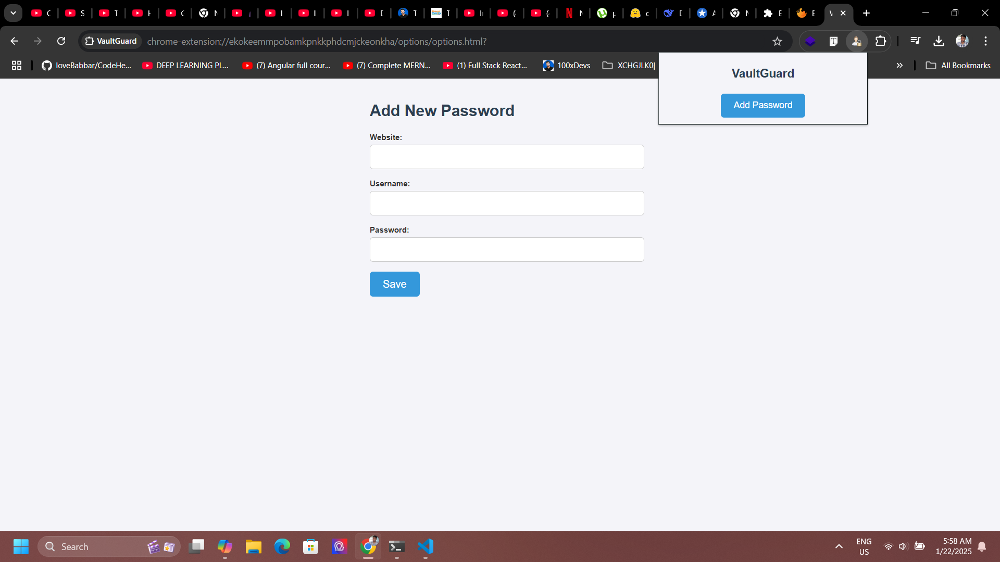

# VaultGuard - Secure Password Manager


VaultGuard is a secure and user-friendly password manager Chrome extension. It allows users to store, manage, and share sensitive information securely online. With a modern and clean UI, VaultGuard ensures that your passwords are always safe and easily accessible.

---

## Features

- **Secure Storage**: Passwords are encrypted before being stored.
- **Easy Management**: Add, edit, and delete passwords with ease.
- **Modern UI**: Clean and intuitive user interface.
- **Cross-Platform**: Works seamlessly across all devices with Chrome.

---

## Installation

### Prerequisites
- Google Chrome browser.

### Steps
1. **Download the Extension**:
   - Clone this repository or download the ZIP file:
     ```bash
     git clone https://github.com/chuck-ankit/VaultGuard
     ```

2. **Load the Extension in Chrome**:
   - Open Chrome and go to `chrome://extensions/`.
   - Enable **Developer Mode** (toggle in the top-right corner).
   - Click **Load unpacked** and select the `vaultguard` folder.

3. **Start Using VaultGuard**:
   - Click the VaultGuard icon in the Chrome toolbar to open the popup.
   - Add and manage your passwords securely.

---

## Demo



---

## File Structure

```
vaultguard/
├── README.md                  # Project documentation
├── LICENSE                    # MIT License
├── manifest.json              # Chrome extension manifest file
├── background.js              # Background script for handling events
├── popup/                     # Popup UI
│   ├── popup.html             # Popup HTML file
│   ├── popup.css              # Styles for the popup
│   ├── popup.js               # Logic for the popup
├── options/                   # Options page
│   ├── options.html           # Options page HTML
│   ├── options.css            # Styles for the options page
│   ├── options.js             # Logic for the options page
├── assets/                    # Static assets
│   ├── icons/                 # Icons for the extension
│   │   ├── icon16.png         # 16x16 icon
│   │   ├── icon48.png         # 48x48 icon
│   │   ├── icon128.png        # 128x128 icon
│   ├── logo.png               # Logo for the extension
│   ├── demo.png               # Demo image
├── styles/                    # Global styles
│   ├── global.css             # Global CSS file
├── scripts/                   # Shared scripts
│   ├── encryption.js          # Encryption/decryption logic
│   ├── utils.js               # Utility functions
```

---

## Contributing

Contributions are welcome! Please follow these steps:

1. Fork the repository.
2. Create a new branch:
   ```bash
   git checkout -b feature/YourFeatureName
   ```
3. Commit your changes:
   ```bash
   git commit -m 'Add some feature'
   ```
4. Push to the branch:
   ```bash
   git push origin feature/YourFeatureName
   ```
5. Open a pull request.

---

## License

This project is licensed under the MIT License. See the [LICENSE](./LICENSE) file for details.

---


## Contact

For questions or feedback, please reach out to:

- **Ankit Kumar**
- **Email**: ankitkumar@gmail.com
- **GitHub**: [chuck-ankit](https://github.com/chuck-ankit)

---
